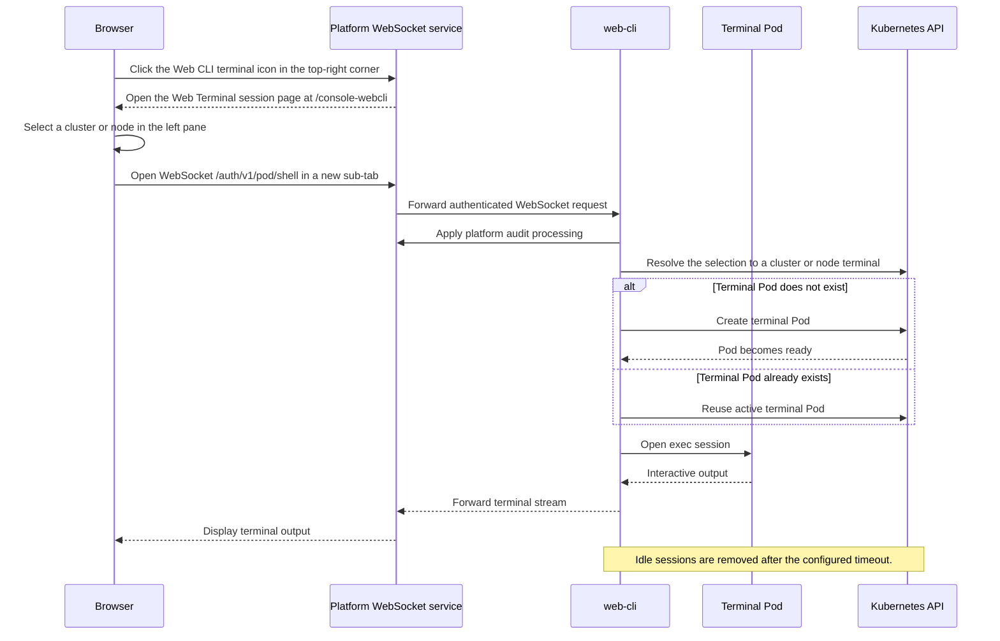

import terminalIcon from './assets/terminal_square.svg'

# Architecture

Web Terminal connects a browser session to a Kubernetes Pod through the platform WebSocket service. The web-cli backend manages cluster clients, creates terminal Pods, and forwards the interactive stream to the browser.

## Interaction Diagram

The following sequence shows how a terminal session is established and how command output returns to the browser.

## Request Flow

The request flow is as follows:

1. Click the  <strong>Web CLI</strong> terminal icon in the top-right corner of the platform page.
2. The platform opens the Web Terminal session page at `/console-webcli`, which lists the available clusters and their nodes in its left pane.
3. Selecting a cluster or a node opens a sub-tab, and the frontend opens the `/auth/v1/pod/shell` WebSocket for that target through the platform service.
4. The platform audit middleware processes the WebSocket request.
5. The terminal handler authenticates the request and resolves the selection to a cluster or node terminal.
6. The terminal manager creates or reuses a terminal Pod in the system namespace.
7. The handler connects the WebSocket stream to the Pod exec session.
8. The manager records activity and periodically reconciles active sessions.

## Session and Pod Management

The terminal manager stores active session records locally, synchronizes them through the `active-terminals` ConfigMap, recovers sessions after a restart, and removes sessions that exceed the idle timeout. It finds terminal Pods with the `web-terminal=true` label selector and checks the cluster terminal capacity before creating a new cluster terminal Pod. See [Terminal Sessions](./concepts/terminal_sessions.mdx) and [Terminal Pods](./concepts/terminal_pods.mdx) for the session lifecycle and Pod semantics.

## Cached Cluster Metadata

The client manager caches cluster clients and Registry metadata for one hour. The cache reduces repeated client creation and expires when the lifetime elapses or the related credentials change.

## Observability Boundary

The service exposes Prometheus metrics at `/terminal/metrics`. Authentication, authorization, and audit processing are provided through the platform server and middleware integration.
